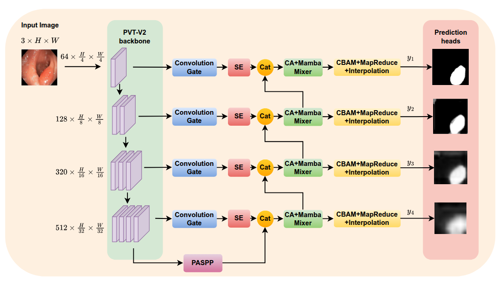
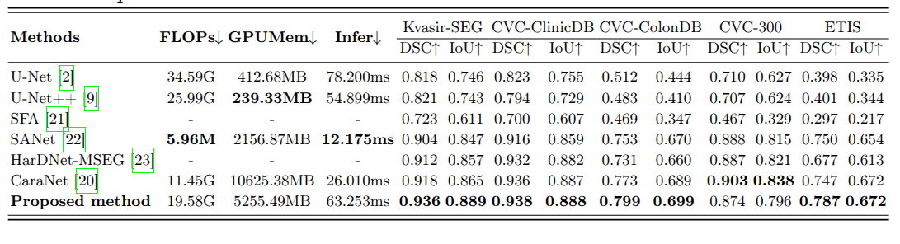

# Polyp Segmentation based on Mamba-MLP Mixer and Transformer (ICISN 2025)

##  Abstract
Polyps, or abnormal tissue growths on the mucous membranes of various organs, have the potential to become cancerous, leading to dangerous conditions such as colorectal cancer. In recent decades, deep learning methods, particularly neural networks, have consistently outperformed traditional methods in identifying polyps from colonoscopy and endoscopy images—tasks that were previously time-consuming. Polyp segmentation is a crucial first step that helps doctors analyze and provide timely intervention or appropriate treatment regimens when necessary. This process has been significantly enhanced by the development of cutting-edge neural network models, particularly those based on Transformers and CNNs. However, considering the significant differences in polyp size, form, and appearance of polyps, polyp datasets present a significant challenge, often requiring methods that integrate both Transformer and convolutional approaches for optimized performance. Motivated by this challenge, as a solution, we present an innovative architecture combining Transformer, convolution, and Mamba-based components, referred to as MixMamba-TransNet. We designed the Mamba-MLP Mixer and Convolution Gate blocks for the model’s decoding process, along with incorporating a deep supervision strategy to achieve promising results on the CVC-ClinicDB and Kvasir-SEG databases. Code is available at: https://github.com/ndhieu2oo3/MixMamba-TransNet.

## Key Contributions  
- Propose **Mamba-MLP Mixer** and **Convolution Gate** modules that fuse VSS blocks, channel MLPs, and convolutions for robust global–local feature representation.
- Develop **MixMamba-TransNet**, a U-shaped segmentation model integrating these modules with Transformer layers and deep supervision.

## Datasets

We evaluate MixMamba-TransNet on widely-used polyp datasets:

- **Kvasir-SEG**: [Kvasir-SEG Data (Polyp segmentation & detection)](https://www.kaggle.com/datasets/debeshjha1/kvasirseg)

## Results Summary
- Demonstrate strong performance on **Kvasir-SEG**, **CVC Clinic-DB**, **ETIS**, **CVC-300**, and **CVC-ColonDB**, outperforming or matching leading polyp segmentation architectures.

## Overview of the MixMamba-TransNet network architecture


### Table 1: Quantitative Results accross polyp datasets



## Citation
If you find this helpful, please cite it here:

```bibtex
@InProceedings{10.1007/978-981-95-1746-6_3,
author="Nguyen, Dinh-Hieu
and Hoang, Ngoc-Khai
and Nguyen, Thanh-Thu
and Tran, Thi-Thao
and Pham, Van-Truong",
editor="Thi Dieu Linh, Nguyen
and Yu, Shiqi
and Selamat, Ali
and Tran, Duc -Tan",
title="Polyp Segmentation Based on Mamba-MLP Mixer and Transformer",
booktitle="Proceedings of the Fifth International Conference on Intelligent Systems and Networks",
year="2026",
publisher="Springer Nature Singapore",
address="Singapore",
pages="19--28",
}